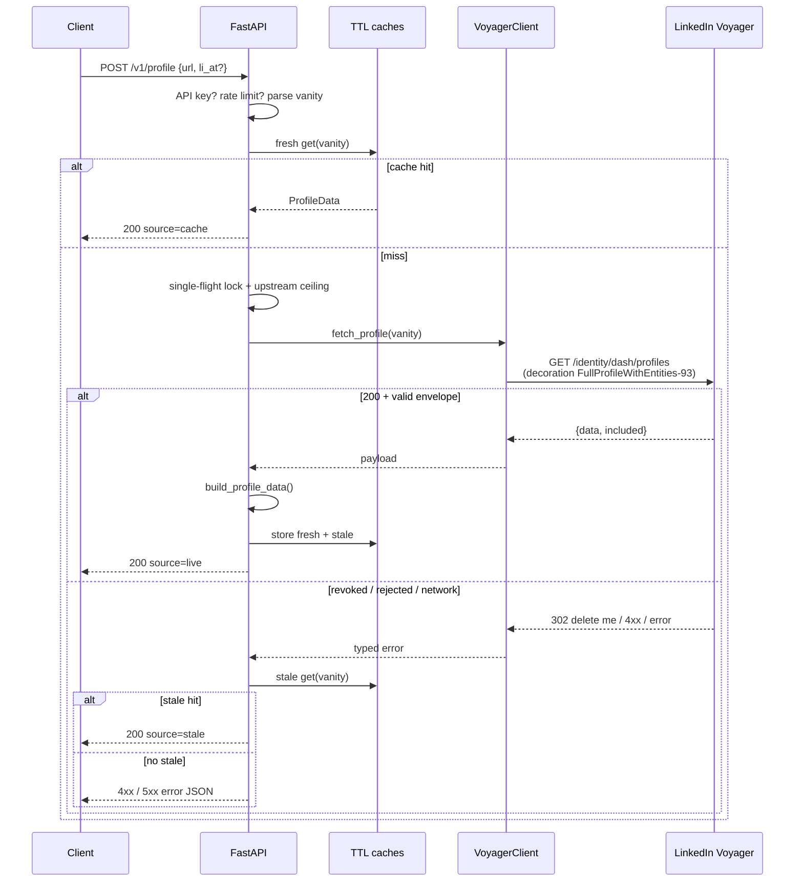

# LinkedIn Profile API

HTTPS API that accepts a LinkedIn profile URL and returns structured JSON — name, headline, location, about, experience, education, skills, certifications, languages, profile images, plus projects / featured media when present.

Calls LinkedIn’s private **Voyager** API over HTTP. **No browser**, Playwright, or Selenium.

| | |
| --- | --- |
| **Live app** | [https://linkedin-profile-api-pdos.onrender.com](https://linkedin-profile-api-pdos.onrender.com) |
| **Swagger** | [https://linkedin-profile-api-pdos.onrender.com/docs](https://linkedin-profile-api-pdos.onrender.com/docs) |
| **Example JSON** | [https://linkedin-profile-api-pdos.onrender.com/v1/profile/example](https://linkedin-profile-api-pdos.onrender.com/v1/profile/example) |
| **Source** | [github.com/SlothT/linkedin-profile-scraper](https://github.com/SlothT/linkedin-profile-scraper) |

- Anyone can open the live app, Swagger, and `/v1/profile/example` with **no credentials**.
- A **live** LinkedIn fetch needs a caller-supplied `li_at` (or server `LINKEDIN_LI_AT`). From Render’s datacenter IP, LinkedIn often revokes that cookie after one call — prefer local run on the same network as the browser.
- Render free tier sleeps after ~15 minutes idle; first hit can take ~50s (`--max-time 90`).

---

## Features

- Public HTTPS deploy + lookup UI
- `POST` / `GET /v1/profile` — `/in/…` URL in, JSON out
- Session via `X-LI-AT`, body `li_at`, or server `LINKEDIN_LI_AT`
- In-process TTL cache, serve-stale, single-flight per vanity
- Per-IP rate limit + process-wide Voyager ceiling
- Typed errors (`SessionRevokedError`, `ProfileNotFoundError`, …)
- Fixture endpoint (same mapper as live) + Swagger
- Secrets only in env / Render — never in git

---

## Try it (no clone)

- **UI:** [linkedin-profile-api-pdos.onrender.com](https://linkedin-profile-api-pdos.onrender.com)
- **Swagger:** […/docs](https://linkedin-profile-api-pdos.onrender.com/docs) — exercise endpoints in the browser
- **Example (no cookie):** anonymised fixture through the real mapper

```bash
curl --max-time 90 https://linkedin-profile-api-pdos.onrender.com/v1/profile/example
```

**Request** — `POST /v1/profile`

```json
{
  "url": "https://www.linkedin.com/in/<vanity>",
  "li_at": "AQEDAxxxxxxxx"
}
```

- `li_at` may instead be header `X-LI-AT`
- Never put the cookie on the query string
- If `LINKEDIN_LI_AT` is set on the server, omit it from the request

**Response** (trimmed; live payloads fill the arrays when LinkedIn returns data)

```json
{
  "success": true,
  "data": {
    "profile": {
      "full_name": "Alex Rivera",
      "headline": "Senior Software Engineer at Northwind | Ex-Contoso",
      "about": "Builds backend systems at Northwind.",
      "location": { "full": "Springfield, Example State, Exampleland", "country_code": "IN" },
      "profile_picture": [{ "width": 800, "height": 800, "url": "https://media.example.invalid/..." }]
    },
    "experience": [],
    "education": [],
    "skills": [],
    "certifications": [],
    "languages": []
  },
  "meta": { "source": "fixture", "cached": false, "stale": false }
}
```

- `meta.source`: `live` | `cache` | `stale` | `fixture`
- `stale: true` is still HTTP **200** (last good data after a transient upstream failure)
- Errors: `{ "success": false, "error": { "type": "SessionRevokedError", "message": "..." } }`

---

## Architecture

```
Client ──HTTPS──▶ FastAPI (Render)
                     │
                     ├─ rate limit (per IP)
                     ├─ resolve li_at
                     ├─ fresh cache hit? ──▶ return
                     ├─ single-flight lock (per vanity)
                     ├─ upstream ceiling
                     ├─ VoyagerClient + curl_cffi (Chrome TLS)
                     │       └── GET LinkedIn Voyager
                     ├─ map {data,included} ──▶ ProfileData
                     └─ write fresh + stale caches
```

**Live lookup sequence**



**Layout**

| Path | Role |
| --- | --- |
| `app/main.py` | Routes, cache, rate limits, single-flight |
| `app/linkedin/client.py` | Voyager HTTP + status → error taxonomy |
| `app/linkedin/mapper.py` | Graph → `ProfileData` |
| `app/linkedin/normalize.py` | URN / `included` resolution |
| `app/schemas.py` | Response models |
| `fixtures/` | Anonymised captures for tests + `/example` |

---

## Setup

Requires **Python 3.13** and [uv](https://docs.astral.sh/uv/).

```bash
git clone https://github.com/SlothT/linkedin-profile-scraper.git
cd linkedin-profile-scraper
uv sync
cp .env.example .env
uv run uvicorn app.main:app --reload
```

- UI: http://127.0.0.1:8000/
- Swagger: http://127.0.0.1:8000/docs

| Env | Purpose |
| --- | --- |
| `LINKEDIN_LI_AT` | Server-side session fallback |
| `API_KEY` | Require `X-API-Key` |
| `PROXY_URL` | Outbound proxy (residential for reliable cloud live) |
| `CACHE_TTL` | Fresh cache seconds (default `900`) |
| `UPSTREAM_LIMIT` | Max Voyager calls / 60s process-wide (default `8`) |
| `RATE_LIMIT_PER_MINUTE` | Per-client cap on `/v1/profile` (default `30`) |

```bash
curl -X POST http://127.0.0.1:8000/v1/profile \
  -H 'Content-Type: application/json' \
  -H 'X-LI-AT: <li_at>' \
  -d '{"url":"https://www.linkedin.com/in/<vanity>"}'
```

---

## API

| Method | Path | Auth |
| --- | --- | --- |
| `POST` | `/v1/profile` | `X-LI-AT` \| body `li_at` \| `LINKEDIN_LI_AT`; optional `X-API-Key` |
| `GET` | `/v1/profile?url=` | Header / server cookie only |
| `GET` | `/v1/profile/example` | None |
| `GET` | `/health` | None |
| `GET` | `/` | None (UI) |
| `GET` | `/docs` | None (Swagger) |

Session order: `X-LI-AT` → body `li_at` → `LINKEDIN_LI_AT`. Person URLs only (`/in/…`).

| `error.type` | HTTP |
| --- | --- |
| `InvalidProfileURLError` | 400 |
| `MissingCredentialsError` / `SessionRevokedError` | 401 |
| `SessionRejectedError` | 403 |
| `ProfileNotFoundError` | 404 |
| `RateLimitedError` | 429 |
| `UpstreamShapeError` | 502 |
| `UpstreamUnavailableError` | 503 |

Local 429s fire **before** LinkedIn is contacted (per-IP limit or `UPSTREAM_LIMIT`).

---

## Approach

- Reverse-engineered Voyager REST (`/voyager/api`) — same private API the website uses
- One GET returns the profile graph:  
  `/identity/dash/profiles?q=memberIdentity&memberIdentity={vanity}&decorationId=…FullProfileWithEntities-93`
- Auth: `li_at` + CSRF double-submit (`JSESSIONID="ajax:…"` cookie, `csrf-token: ajax:…` header). Synthesised CSRF works
- TLS: `curl_cffi` Chrome impersonation; plain `httpx`/`requests` fail PerimeterX. Do not override `User-Agent`
- `allow_redirects=False` — revocation is a `302` with `li_at="delete me"`; following redirects loops
- Envelope `{data, included}`; `*`-keys are URNs into `included` (collections are two hops)
- Voyager **omits** empty fields (no `null`) — mapper uses `.get()` everywhere; two fixtures used to avoid false “unsupported field” conclusions
- Stack: Python 3.13, FastAPI, Pydantic, `curl_cffi`

Not used: dead `profileView` (410), GraphQL `queryId` scraping, browser automation.

---

## Limitations

- Cloud/`li_at` sessions often die after one Voyager call (datacenter IP / impossible travel) — local same-network or residential `PROXY_URL`
- Skills: 20 returned; total in `meta.truncated`
- No follower / connection counts in this decoration
- Some sections mapped but unverified on fixtures (`meta.unverified_sections`)
- Decoration IDs can rotate (`-93`, fallback `-128`)
- In-process cache/limits reset when Render sleeps
- Private API / ToS — hiring challenge only, not production

---

## Security

- Cookies are per-request — not persisted; redacted from logs
- Secrets only in `.env` / Render (`.env` gitignored)
- Cache keyed by vanity, read **after** auth — cannot skip `API_KEY` / missing cookie
- Fixtures anonymised; raw captures gitignored
- Treat `li_at` as a full login — do not share others’ cookies

---

## Testing

No LinkedIn credentials or network (fake transport injected):

```bash
uv sync
uv run pytest -q
uv run ruff check .
```
